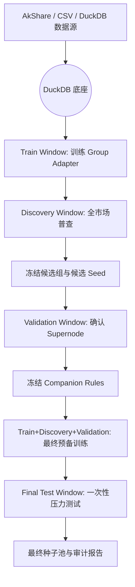

# TimesFM A股预测系统：严格无泄漏版架构与研究设计

## 1. 目标与边界

本项目尝试利用 Google 开源的时序基础模型 **TimesFM (Time Series Foundation Model)**，在 A 股市场中构建一套可审计、可复现、严格前视的超额收益研究框架。

系统的核心目标不是证明“模型在历史上曾经有效”，而是回答两个更严格的问题：

1. 在**完全不接触未来数据**的前提下，TimesFM 是否能在部分分组中形成稳定的方向判断能力。
2. 在严格冻结筛选规则后，系统是否仍能在**最终未见测试区间**维持可接受的胜率、收益质量与回撤控制。

本设计明确放弃以下不严谨做法：

1. 用同一段测试期同时做参数选择、种子筛选和最终结论。
2. 用测试期或测试期之后的数据构建 companion groups。
3. 把“组内最优回测结果”直接当成最终可交易证据。

---

## 2. 核心理念

本系统仍然采用 **“级联式焦点挖掘” (Cascaded Focus Mining)** 的研究思路，但这里的“级联”被重新定义为：

1. **阶段性筛选**：前一阶段只产生候选，不产出最终结论。
2. **严格冻结**：每一阶段结束后，候选集合、参数配置和分组定义都必须冻结。
3. **独立验证**：后一阶段只能验证前一阶段冻结的东西，不能回头改规则。

因此，系统不是“三级连续优化”，而是“三级筛选 + 最终未见测试”。

---

## 3. 严格时间分层

### 3.1 四段式时间切分

任一研究批次必须先固定四段互不重叠的时间窗口：

1. **训练窗 (Train Window)**：只用于训练 adapter、计算标准化量和拟合 companion 特征底座。
2. **发现窗 (Discovery Window)**：只用于分组普查、候选组筛选、初步 supernode 候选发现。
3. **验证窗 (Validation Window)**：只用于复核 supernode 候选与 companion 规则是否稳定。
4. **最终测试窗 (Final Test Window)**：只用于一次性最终评估，不允许再改参数、改分组、改种子名单。

### 3.2 当前建议的绝对日期示例

若当前批次采用 2026 年初的最近样本，则建议如下切分：

1. **Train Window**：截至 **2025-12-31**
2. **Discovery Window**：**2026-01-01** 至 **2026-01-31**
3. **Validation Window**：**2026-02-01** 至 **2026-02-20**
4. **Final Test Window**：**2026-02-21** 至 **2026-03-10**

以上日期是一个明确示例，不是唯一方案；但任何批次都必须先写入配置，再运行脚本。

### 3.3 信息使用约束

每个阶段可见的信息边界如下：

1. 阶段一只能访问 `Train + Discovery`。
2. 阶段二只能访问 `Train + Discovery + Validation`，但不能访问 `Final Test`。
3. 阶段三训练时可以使用 `Train + Discovery + Validation` 做最终预备训练，但所有评估结论只能来自 `Final Test`。
4. 任意阶段都不得使用 `Final Test` 数据参与选组、选股、调参、建 companion。

---

## 4. 三级级联研究架构

### 阶段一：全市场普查 (Census / Discovery)

这是系统的海选层，但它的职责被严格限定为“发现候选”，不是“宣布胜利”。

#### 输入

1. `market.duckdb`
2. `index_market.duckdb`
3. 已预注册的参数组合，例如：
   - `feature_set`
   - `train_days`
   - `horizon`
   - `context_len`
   - `model_type`

#### 允许做的事

1. 在 `Train Window` 内训练 group-level adapter。
2. 在 `Discovery Window` 内评估每个分组的方向质量与交易质量。
3. 输出候选组、候选股票、候选 supernode 名单。

#### 不允许做的事

1. 不能在 `Discovery Window` 上挑最优 `context_len`。
2. 不能在 `Discovery Window` 上同时比较大量参数后，只保留最幸运结果而不留审计轨迹。
3. 不能把阶段一结论直接当成最终策略证据。

#### 输出

1. `group_full_results.csv`
2. `results.csv`
3. `group_top3_summary.csv`
4. 一份包含时间边界与参数哈希的 `meta.json`

### 阶段二：超级节点确认 (Supernode Validation)

阶段二不是继续“从同一窗口里挑更强的赢家”，而是用独立的 `Validation Window` 去确认候选是否稳定。

#### 输入

1. 阶段一冻结后的候选组名单
2. 阶段一冻结后的候选股票名单
3. 阶段一冻结后的参数配置

#### 允许做的事

1. 在 `Validation Window` 上复核候选股票是否仍在多个优质组中重复出现。
2. 用固定阈值确认 supernode，而不是临时改阈值。
3. 记录哪些候选在验证期失效。

#### 不允许做的事

1. 不能在验证期重新发明 ranking 规则。
2. 不能因为验证效果差，就回头调整阶段一的阈值后再宣称“验证通过”。
3. 不能访问 `Final Test Window`。

#### Supernode 的严格定义

一只股票只有在以下条件同时满足时，才进入最终 seed 池：

1. 在 `Discovery Window` 中满足跨组重复出现条件。
2. 在 `Validation Window` 中仍满足同一套重复出现或排名稳定条件。
3. 在 discovery 与 validation 两段里，都满足最低 Long Hit Rate / Profit Factor / 覆盖度要求。

### 阶段三：Companion 构建与最终压力测试

阶段三针对已经确认的 seed，构造 companion groups，并在最终未见窗口上做一次性验证。

#### Companion 构建原则

companion groups 可以基于以下信息构造：

1. `Train Window` 内的历史收益相关性
2. `Discovery Window` 内的同步率、波动相似度
3. `Validation Window` 结束前已经可见的组内共现信息

companion groups 绝不能使用：

1. `Final Test Window` 的任何价格、收益、排序结果
2. `Final Test Window` 中 seed 的表现

#### 变体定义

可保留三类 companion 变体，但其构造规则必须在进入最终测试前冻结：

1. **v1 Balanced**：综合得分最高的稳健陪跑组
2. **v2 High Corr**：相关性最高的高同质组
3. **v3 Stable Vol**：波动结构最接近的稳定背景组

#### 最终训练与最终测试

1. 在 companion 规则冻结后，允许使用 `Train + Discovery + Validation` 重新训练 seed 专属 adapter。
2. 训练完成后，必须锁定：
   - seed 名单
   - companion 名单
   - 参数配置
   - 打分口径
3. 只在 `Final Test Window` 上做一次性评估。
4. Final Test 结果只能用于报告，不允许再参与任何模型选择。

---

## 5. 参数选择规则

### 5.1 可调参数的归属

参数必须明确归属到以下两类之一：

1. **预注册参数**：在整批实验开始前固定，例如 `horizon=1`、`feature_set=full`。
2. **内层选择参数**：只能在训练侧完成选择，例如在 `Train Window` 内部再划一个小的内层验证集来决定 `context_len`。

### 5.2 明确禁止

以下做法被视为泄漏或后验优化：

1. 在 `Discovery Window` 上比较多个 `context_len`，然后取最优者作为正式结论。
2. 在 `Validation Window` 上重新调阈值。
3. 在 `Final Test Window` 上做任何形式的超参数选择。

---

## 6. 指标体系与口径统一

所有指标必须与真实执行口径一致，不能把“方向预测正确率”和“做多策略命中率”混为一谈。

### 6.1 核心指标

1. **Long Hit Rate**
   - 定义：仅在模型发出做多信号时，未来 `K` 日实际收益为正的比例。
   - 这是做多策略的主命中率，不统计无信号样本。

2. **Directional Hit Rate**
   - 定义：对全部样本，预测方向与真实方向一致的比例。
   - 这是辅助诊断指标，不能替代 Long Hit Rate。

3. **Profit Factor**
   - 定义：做多信号下盈利绝对额总和 / 亏损绝对额总和。

4. **Max Drawdown**
   - 定义：策略资金曲线在测试窗口内的最大回撤。

5. **Recent Avg Ret / Recent Cum Ret**
   - 定义：最近 20/40/60 个有效样本上的平均收益与累计收益。

6. **Exposure / Coverage**
   - 定义：信号覆盖比例与参与交易比例。
   - 低覆盖、高胜率的模型必须单独标注，不能与高覆盖模型直接并列。

### 6.2 基准对照

每次报告都必须同时给出以下对照：

1. **Zero-shot baseline**
2. **Group adapter**
3. **Seed-specific adapter**

没有 baseline 对照的高胜率，不视为有效证据。

---

## 7. 数据底座与审计要求

### 7.1 DuckDB 底座

项目继续以 DuckDB 作为统一数据底座：

1. `market.duckdb`：个股日线量价数据
2. `index_market.duckdb`：行业、概念、动态 group definitions

### 7.2 每个任务包必须固化的元数据

每次任务都必须记录：

1. `train_end`
2. `discovery_start` / `discovery_end`
3. `validation_start` / `validation_end`
4. `final_test_start` / `final_test_end`
5. `feature_set`
6. `train_days`
7. `context_len`
8. `horizon`
9. `model_type`
10. `group_definition_hash`
11. `candidate_selection_rules`

如果缺少上述元数据，则该批结果不进入正式比较。

---

## 8. 工程脚本与阶段映射

### 8.1 建议映射

1. `run_census_task.sh`
   - 只负责阶段一
   - 必须显式传入 `TRAIN_END`、`DISCOVERY_START`、`DISCOVERY_END`

2. `summarize_supernodes.py`
   - 只消费阶段一的 discovery 结果
   - 输出“待验证 seed 候选”

3. `build_seed_companion_groups.py`
   - 只能读取 `Validation Window` 结束前可见的数据
   - 必须显式设置 `--end <= validation_end`

4. `run_seed_group_eval.sh`
   - 只负责阶段三的最终测试
   - 输入必须是冻结后的 seed definitions

### 8.2 文件契约

为了防止脚本串联时出现口径漂移，建议统一以下文件契约：

1. 每个 group 目录必须产出 `results.csv`
2. 若保留快照文件，则只能作为兼容产物，不能替代 `results.csv`
3. 汇总脚本必须只消费同一批次、同一时间切分下的结果，不能按修改时间混读

---

## 9. 项目流程图（严格版）

---

## 10. 未来演进方向

在严格无泄漏框架成立后，后续扩展方向包括：

1. **反向信号研究**：研究下行阶段的反向或对冲信号，但依然遵守相同时间隔离规则。
2. **多变量通道**：在收盘价之外加入换手率、资金流、量能结构等变量。
3. **横向稳健性检验**：增加 bootstrap、滚动窗口重复验证与多批次时间重放。
4. **信号产物化**：把最终通过 Final Test 的种子池转化为每日观察名单、权重表和交易候选单。
