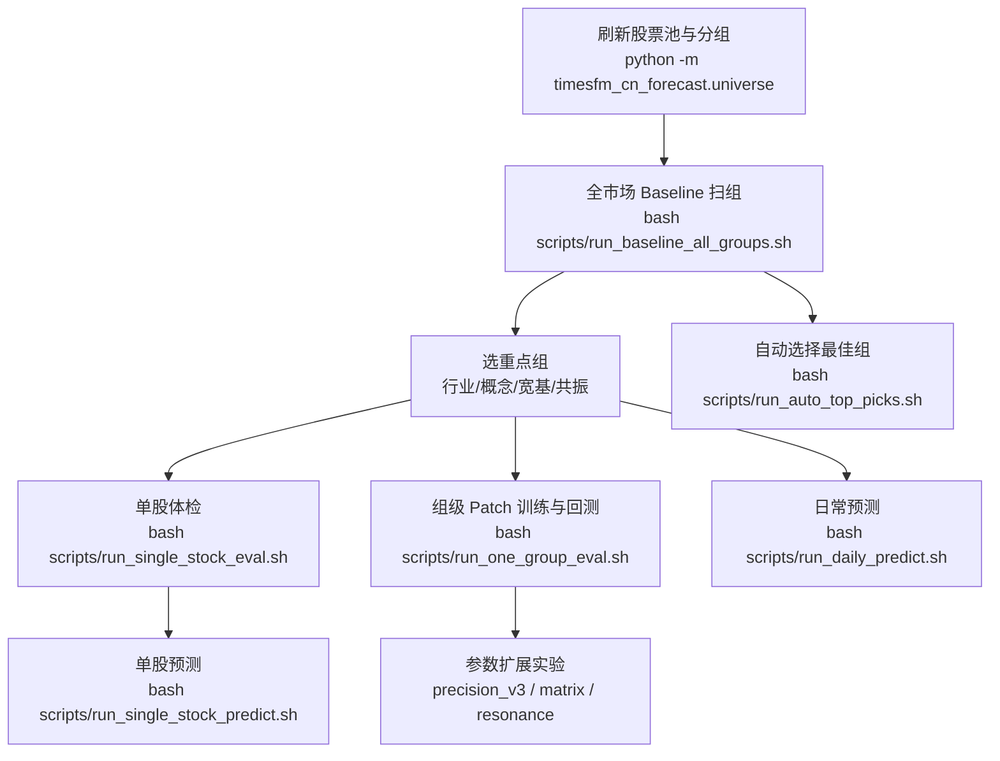
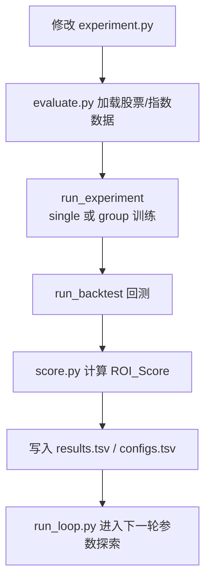

# 三套研究分支合并总结

更新时间：2026-03-19

## 1. 仓库定位与当前运行状态

### A. `timesfm-cn-forecast-clean`

定位：
- 手工驱动 + 脚本化批量实验平台
- 重点在单股、分组、Baseline、Patch、共振组、日常预测

当前已跑出的任务包数量：
- `baseline_all_groups`: 4 轮
- `baseline_extended`: 3 轮
- `precision_v3`: 6 轮
- `massive_matrix`: 3 轮
- `resonance_v2`: 8 轮
- `eval_single`: 12 轮
- `predict_single`: 2 轮
- `matrix_*`: 4 轮
- `finetune_top3`: 2 轮

当前工作区状态：
- 仍有未提交改动，主要集中在 `src/timesfm_cn_forecast/backtest.py`、`src/timesfm_cn_forecast/features.py`、`src/timesfm_cn_forecast/finetuning.py`、`src/timesfm_cn_forecast/run_group_eval.py`
- 另有一批实验脚本和日志尚未提交

已经能做的事情：
- 单股评估：`scripts/run_single_stock_eval.sh`
- 单股预测：`scripts/run_single_stock_predict.sh`
- 分组 Baseline：`scripts/run_baseline_all_groups.sh`
- 分组 Patch 训练与回测：`scripts/run_one_group_eval.sh`
- 扩展板块扫描：`scripts/run_baseline_extended.sh`
- 共振组实验：`scripts/run_resonance_v2.sh`
- 每日组内选股：`scripts/run_daily_predict.sh`

### B. `autoresearch`

定位：
- 自动化参数研究平台
- 核心思路是固定基础设施，只改 `timesfm_autoresearch/experiment.py`
- 目标不是“某一只股票最好”，而是“组平均 ROI_Score 最好”

当前日志与运行痕迹：
- `configs.tsv`: 123 条配置快照
- `results.tsv`: 2538 条结果，其中 `keep` 结果 2500 条
- `ROUND_END` 分隔符：38 个
- 已经跑过的组主要是：`HS300`、`ZZ500`、`ZZ800`、`zero_shot`
- `outputs/` 下已有大量按股票生成的 `adapter.pth` 和 `history.csv`
- 已生成 `outputs/top10_round4.csv` 到 `outputs/top10_round7.csv`
- 最新配置时间晚于最新结果时间，说明最后一轮大概率没有完整跑完，或者中途被打断

当前工作区状态：
- 仍有未提交改动
- `configs.tsv`、`program.md`、`timesfm_autoresearch/evaluate.py`、`timesfm_autoresearch/experiment.py` 有修改
- `timesfm_autoresearch/run_loop.py` 仍是未跟踪文件
- `.kiro/specs/timesfm-autoresearch/` 下有删除项

当前自动研究的真实情况：
- 这套系统已经不是“空壳”
- 它确实跑过多轮自动实验，并沉淀了较系统的参数搜索思路
- 但日志快照字段不完整，不能把所有细粒度结论都当成已被严格验证

### C. `timesFM_fc`

定位：
- 更老一代的 TimesFM 本地部署与 FC 化打包版本
- 重点不是分组研究，而是：
  - 全市场横向误差评估
  - 单个全局 adapter 的泛化能力
  - 每日权重输出
  - Top gainers 排序

当前能看到的产物：
- `outputs_all_ashares/summary.json`
- `outputs_all_ashares/detailed_results.csv`
- `outputs_all_ashares_comparison/{global,auto,no_adapter}/summary.json`
- `outputs_daily_weights/daily_weights_2025-11-12.csv`
- `outputs_daily_weights/daily_weights_summary_2025-11-12.json`
- `outputs_top_gainers/top_gainers.json`

当前工作区状态：
- `README.md`、`examples/data.py`、`examples/finetune_stock.py` 有改动
- `examples/daily_weights.py`、`examples/plot_kline.py` 是未跟踪文件
- `outputs_daily_weights/`、`outputs_kline/` 也是未跟踪产物

这个老仓库最值得看的，不是代码结构本身，而是它留下的两类证据：
- “全市场 sample 上，单个全局 adapter 是否普遍改善误差”
- “预测结果怎样进一步产物化成 top picks / daily weights”

老仓库已经跑出的有价值结果：
- `outputs_all_ashares/detailed_results.csv`
  - 评估股票数：490
  - adapter 后 `MAPE` 改善股票数：420
  - 改善占比：约 `85.7%`
- `outputs_all_ashares_comparison/global/detailed_results.csv`
  - 评估股票数：225
  - `global adapter` 改善股票数：195
  - 改善占比：约 `86.7%`
- `outputs_all_ashares_comparison/auto/detailed_results.csv`
  - 评估股票数：227
  - `auto adapter_scope` 改善股票数：86
  - 相等股票数：128
  - 这说明 “只有命中训练范围才套 adapter” 的保守模式，改善更少，但副作用也更小
- `outputs_daily_weights/daily_weights_summary_2025-11-12.json`
  - 全市场代码数：5420
  - 成功预测：5381
  - 被分配权重：2347
  - 说明它已经做过一次“全市场预测 -> 转成权重表”的完整批量产物化

## 2. 两边合并后的核心结论

### 2.1 比较靠谱的结论

1. 先做不加 Patch 的组级 Baseline，是目前最靠谱的入口。
   原因：`timesfm-cn-forecast-clean` 里已经看到不少组在原始模型下就有一定区分度，而加 Patch 后并不一定提升。

2. `group` 训练整体上比 `single` 训练更值得优先研究。
   证据：
   - `timesfm-cn-forecast-clean/data/tasks/single_vs_group_comp/comparison_report.csv` 中，10 个样本里 8 个是组训练优于单股训练，1 个持平，1 个单股更好。
   - `autoresearch/results.tsv` 中，按日志描述统计，`group` 训练样本量远多于 `single`，且在组级目标上被持续保留。
   - 但也要注意：`autoresearch` 里 `group` 的原始 `win_rate` 低于 `single`，只是 `roi` 代理分数和组级目标更占优。当前日志粗看大致是：
   - `group`: 平均 `roi≈0.988`，平均 `win_rate≈0.242`
   - `single`: 平均 `roi≈0.958`，平均 `win_rate≈0.450`
   - 这说明它更像“低胜率但更稳的组规律”，不是简单的“命中率更高”。

3. “陪跑员”思路是成立的。
   也就是：
   - 不是每只股票都适合自个预测自个
   - 有些股票放在一个相似组里，用组级规律反而更稳
   - 最终落地应是“先找靠谱组，再找组内最稳的少数股票”

4. “每组盯前三支”的方向非常对。
   合并两边仓库后，最自然的实盘框架就是：
   - 先筛组
   - 再筛到组内 20 支
   - 再保留最近滚动表现最稳的前 3 支
   - 只有这 3 支里出现足够强的信号才下手

5. 非传统分组值得继续做。
   当前项目里最有希望的，不只是行业组、概念组、宽基组，还包括：
   - 共振相关性组
   - 波动率相似组
   - 以某个种子股扩出来的“高相关陪跑员组”

6. 老版本里的“全市场横向评估”思路值得恢复到新项目里。
   证据：
   - `timesFM_fc` 不是只评几只股票，而是已经留下了 `500` 股票级别的横向误差对比结果
   - 这证明“先做大样本普查，再决定下一步研究方向”是可行的
   - 新项目现在缺的不是脚本，而是把这种“大样本横评能力”正式接回现在的分组框架

7. 老版本里的“daily weights / top gainers”值得转成现在项目的正式输出层。
   因为你最终不是只要研究报告，而是要能快速落到实盘观察和筛选。

### 2.2 暂时只能当作假设的结论

1. “短上下文更适合 group，长上下文更适合 single”
   这个在 `autoresearch/program.md` 里被总结过，但当前日志快照并没有完整记录 `momentum / alpha / model_type` 等全部配置，不能当成最终定论。

2. “Huber 一定比 Ridge 更好”
   `autoresearch` 明显在认真比较 `HuberRegressor` 和 `Ridge`，但现有 `configs.tsv` 没有把 `MODEL_TYPE` 独立记清，很多结论只能从 `notes` 反推，证据还不够硬。

3. “1 天一定优于 5 天”
   目前更合理的说法是：
   - 1 天更贴近你的交易需求
   - 但 5 天可能更稳定
   - 是否优于，要用真实滚动收益来判，不该凭直觉定

4. “动量特征一定有效”
   `autoresearch/program.md` 里已经提到动量与长上下文可能存在替代关系，这说明它更像条件成立的局部规律，不是全局真理。

5. “alpha 目标一定更好”
   `autoresearch` 已经把 `USE_ALPHA_TARGET` 设计进去了，这是非常好的方向，但从现有日志还看不出它已经形成稳定优势。

### 2.3 当前证据相反，或不能直接采用的结论

1. “加 Patch 一定比不加 Patch 好”
   当前证据不支持。

   在 `timesfm-cn-forecast-clean` 中，对同一批重点组做 baseline 与 patch 对照后，当前结果里 patch 普遍更差，例如：
- `ind_白酒`: patch 相比 baseline 平均 HitRate 下降约 47 个点
- `con_华为概念`: 下降约 38 个点
- `con_比亚迪链`: 下降约 33 个点

   所以当前不能把 “Patch 是自然增益” 当作前提。

2. `autoresearch` 里的 `ROI` 不能直接当作真实收益率。
   该仓库中：
- `roi = max(0, 1 - MAPE / 100)`
- 这是“误差映射分数”，不是实盘收益
- 它适合做相对排序，不适合直接解释成“赚了多少钱”

3. `autoresearch` 中大量 `roi=1.0 / rmse=0.0 / roi_score=0.88` 的满分样本，不能直接相信。
   这些结果非常可能受到训练/评估重叠的影响。

4. `timesFM_fc` 里“全局 adapter 广泛提升”这个结论不能直接照搬到现在项目。
   原因有两个：
- 它用的核心口径主要是 `MAE/MAPE`
- `examples/finetune_stock.py` 的训练时间段覆盖到了 `eval_all_ashares.py` 的评估区间，存在训练/评估重叠的高度嫌疑

也就是说：
- 这个老结果说明“全局 adapter 有潜力”
- 但不能说明“它在真实未来滚动回测里一定仍然有效”

## 3. 两边共同存在的方法学风险

### 3.1 最大问题：训练集和测试集疑似重叠

这是两边仓库合并后最重要的新发现。

#### 在 `timesfm-cn-forecast-clean` 中

- 单股流程 `scripts/run_single_stock_eval.sh`
  - 先用整段 `history.csv` 训练 adapter
  - 再对同一段数据的最后 `test_days` 做回测

- 分组流程 `src/timesfm_cn_forecast/run_group_eval.py`
  - `_build_training_samples()` 会直接从每只股票尾部切出训练样本
  - 随后 `run_backtest()` 又对最后 `test_days` 天做滚动评估

如果训练样本覆盖到了测试区间，就会产生“看过答案再考试”的风险。

#### 在 `autoresearch` 中

- `timesfm_autoresearch/experiment.py`
  - `_train_from_single()` / `_train_from_group()` 直接用目标数据尾部训练
  - `run_experiment()` 随后又拿同一只股票最后 `TEST_DAYS` 做回测

这会导致：
- 分数偏高
- 很容易出现 `rmse=0.0`
- 很多“满分股票”不可信

#### 在 `timesFM_fc` 中

- `examples/finetune_stock.py`
  - 训练数据区间是 `2022-01-01` 到 `2025-10-22`
- `examples/eval_all_ashares.py`
  - 评估区间是 `2025-07-21` 到 `2025-10-21`

这两个区间明显重叠。

因此老仓库里：
- “全局 adapter 大面积改善 MAPE” 这个现象有参考价值
- 但它更像“模型容量与泛化潜力”的证据，不是严格无泄漏的实盘证据

### 3.2 `group` 在 `autoresearch` 中有打分加成

`timesfm_cn_forecast/score.py` 中定义：

```text
Score = 0.7 * ROI + 0.2 * WinRate - 0.1 * (horizon / 5) + 0.05(group bonus)
```

所以：
- `group` 和 `single` 的 `ROI_Score` 不是完全公平的裸比
- 做对照时应该同时看：
  - 原始 `roi`
  - 原始 `win_rate`
  - 原始 `rmse`

## 4. 当前可信进度更新

更新时间：2026-03-19 上午

这一节只记录已经被当前仓库结果文件和运行进程直接验证过的内容，用来替代聊天里的口头“战报”。

### 4.1 共鸣组主线当前跑到哪里

`timesfm-cn-forecast-clean` 当前最明确还在运行的是：
- `data/tasks/resonance_v2_20260318_105725`

这一批次目前状态是：
- 已完成并产出结果文件的共鸣组：7 组
- 仍在运行中的共鸣组：1 组
- 当前正在跑的组：`resonance_sz301327`

已经完成结果落盘的组包括：
- `resonance_sh600519`
- `resonance_sh688095`
- `resonance_sh688152`
- `resonance_sh688695`
- `resonance_sz300057`
- `resonance_sz300292`
- `resonance_sz300656`

因此，之前“第 5 组 `sz300656` 正在跑”的表述已经过时。更准确的说法是：
- `sz300656` 已经跑完并产出结果
- 当前真正未收口的是 `sz301327`

### 4.2 已经被结果文件确认的阶段性发现

当前已完成的 7 个共鸣组中，平均 `hitrate` 大约落在 `42%` 到 `45%` 区间：

- `resonance_sh600519`: `42.58%`
- `resonance_sh688095`: `45.00%`
- `resonance_sh688152`: `43.83%`
- `resonance_sh688695`: `44.32%`
- `resonance_sz300057`: `42.59%`
- `resonance_sz300292`: `42.71%`
- `resonance_sz300656`: `45.41%`

这说明当前最靠谱的判断是：
- 共鸣组并不会让组里所有股票都变得容易预测
- 但它确实可能像“放大器”一样，把少数规律稳定的股票顶到更高的胜率区间

### 4.3 当前已经坐实的“超级节点”

截至目前，已经能从结果文件中直接看到一些高胜率股票反复出现：

- `002777` 在 `resonance_sz300292` 中达到 `55.46%`
- `300079` 在 `resonance_sz300656` 中达到 `53.78%`
- `600519` 在 `resonance_sh600519` 中达到 `53.78%`
- `300079` 在 `resonance_sh688095` 中再次达到 `53.78%`
- `002673` 在 `resonance_sh688695` 中达到 `52.94%`
- `300070` 在 `resonance_sh688695` 中达到 `52.10%`

这里最值得注意的不是“每个组都很强”，而是：
- 少数股票在不同共鸣组中会反复出现
- 这些反复出现的股票，更像你后面实盘要盯的“超级节点”

尤其是：
- `300079` 已经在多个组里重复出现高胜率表现
- `600519` 作为种子组核心节点，本组内表现也确实较强

### 4.4 A/B Test 当前真实进度

关于“single 训练 vs group 训练”的专项对比，当前更准确的状态是：

- `ab_test` 相关进程已经启动
- `single_2673` 的运行进程目前仍然存在
- 但 `data/tasks/ab_test/` 下暂时还没有正式结果文件
- 当前能看到的只有空日志文件

这意味着：
- 不能说 A/B test 没开始
- 但也不能说它已经产出结论

所以截至当前时间点，更稳妥的说法是：
- `group > single` 仍然主要依赖已有对比实验和共鸣组结果来支撑
- `single_2673` 这一轮专门的隔离 A/B test 还没有正式收口

### 4.5 当前可信版战报

如果需要给外部同步一版不过度夸张的进度，可以使用下面这个版本：

- 共鸣组主线当前已完成 7 组，正在运行第 8 组 `resonance_sz301327`
- 目前已完成组的平均胜率大致稳定在 `42%-45%`
- 共鸣组的价值不在于“全组普涨”，而在于能从组内放大出少数 `52%-55%` 的强节点
- 当前已经坐实的强节点包括 `600519`、`300079`、`002777`、`300070`
- `300079` 在多个共鸣组中重复出现高胜率，具备“超级节点”特征
- 单股 A/B test 已启动，但还没有形成正式结果文件，暂时不能用它来最终裁定 `single` 或 `group`

### 4.6 这一阶段最重要的两件事

1. 等 `resonance_sz301327` 完成，收齐这一轮 `resonance_v2` 的最后一个结果文件。
2. 等 `ab_test` 产生正式结果，再用同一批股票、同一时间窗口，严格比较：
   - `group` vs `single`
   - 不加 patch vs 加 patch
   - 历史均值表现 vs 最近滚动表现
  - 再看 `roi_score`

### 3.3 `autoresearch` 的配置快照还不够完整

当前 `configs.tsv` 自动记录的主要字段只有：
- `FEATURE_SET`
- `CONTEXT_LEN`
- `TRAIN_DAYS`
- `HORIZON`
- `TEST_DAYS`
- `TRAIN_SOURCE`

但很多真正关键的实验变量没有被结构化记录，例如：
- `MODEL_TYPE`
- `USE_MOMENTUM_FEATURES`
- `USE_ALPHA_TARGET`
- `HUBER_EPSILON`
- `RIDGE_ALPHA`

所以 `program.md` 里的很多“35 轮实验总结”，目前更适合作为研究笔记，而不是最终结论。

### 3.4 `timesFM_fc` 有安全和工程层遗留问题

这个老仓库里还有两个明显问题，不能直接照搬：

1. `examples/data.py` 里存在硬编码 OSS 凭证。
   这必须视为历史遗留问题，后续绝不能沿用。

2. 数据加载高度依赖 OSS CSV，和当前主项目基于 DuckDB 的本地研究框架不一致。
   它的价值在于流程原型，不在于继续保留原始数据接入方式。

## 4. 当前主流程图

### 4.1 `timesfm-cn-forecast-clean` 主流程



### 4.2 `autoresearch` 主流程



### 4.3 两边合并后的角色分工

- `timesfm-cn-forecast-clean`
  - 更像主战场
  - 负责真实板块、真实任务包、真实手工验证和日常预测

- `autoresearch`
  - 更像研究加速器
  - 负责自动化试参数、比较 single/group、比较 context/model/feature 组合

- `timesFM_fc`
  - 更像旧版本原型库
  - 提供两个可迁移资产：
  - 大样本横向误差评估原型
  - daily weights / top gainers 产物化原型

## 5. 合并后的统一研究设计

### 第一层：先做全市场组级 Baseline，不加 Patch

目的：
- 快速找到“天然有规律”的组
- 不让 adapter 先把结果污染

优先跑的组：
- 行业组
- 概念组
- 共振相关组
- 波动率分层组
- 以某只种子股为中心扩出来的高相关组

执行建议：
- 每组先随机 10 支
- 只跑最近 20 到 60 天滚动窗口
- 先看最近，不看全历史均值
- 同时恢复 `timesFM_fc` 里的“大样本横向评估”思路：
- 每一轮都保留一批跨组、跨股票的大样本误差/收益普查，用来防止只在少数样本上得出错觉

### 第二层：从每组 50 支缩到 20 支，再缩到 3 支

建议流程：
1. 先用种子股扩出 50 支高相关陪跑员
2. 先做 baseline 评估
3. 选出最近滚动最稳的 20 支
4. 再保留最近表现最稳的前 3 支

最终不是“整组都买”，而是：
- 每组只盯最稳的前三支
- 每天只在这些股票里找机会

### 第三层：只对重点组做 Patch A/B

Patch 不应该全市场上来就跑。

正确顺序应是：
1. 先 Baseline 选组
2. 再在重点组里做 `no patch vs patch`
3. 再做 `single vs group`
4. 再做 `ridge vs huber`
5. 最后再比较 `1天 vs 5天`

也就是说，Patch 应该是精调阶段，不是第一阶段。

### 第四层：评估指标统一成“两套分数”

建议明确分成两套：

#### A. 研究分数
- RMSE
- MAE
- MAPE
- HitRate
- IC / RankIC
- 最近 20 / 40 / 60 天滚动稳定性

#### B. 交易分数
- 平均单笔收益
- 胜率
- 累计收益
- 最大回撤
- 盈亏比
- 最近滚动收益斜率

#### C. 横向普查分数
- 大样本 `MAE/MAPE` 普查
- adapter vs no-adapter 改善比例
- group vs single 改善比例
- Top-K 命中率
- 权重输出后的集中度

不要再把“误差分数”和“赚钱分数”混成一个口径。

### 第五层：交易层只看最近状态

最终应该做的是：
- 不是问“过去两年谁最强”
- 而是问“最近 20 到 60 天，哪个组里的哪 3 支最稳”

这一步非常重要。

你之前提到的：
- “不是过去好，而是最近滚动好”
- “要看 IC 的变化”

这两个判断是对的，而且应该进入下一阶段的核心设计。

## 6. 合并后的最终判断

### 目前最靠谱的一句话

先用不加 Patch 的组级 Baseline 找到“天然有规律”的组，再在每个组里找最近滚动最稳的前三支股票，最后只对重点组做 Patch 精调和 single/group A/B。

### 目前不应该再默认相信的事情

- 不要默认单股一定比组训练更准
- 不要默认 Patch 一定增益
- 不要把 `autoresearch` 里的 `ROI` 当作真实收益
- 不要把当前很多“满分样本”当作已经可实盘的证据

## 7. 下一步优先级

### P0：先修回测口径

必须先做：
- 明确训练结束日
- 回测从训练结束后的下一天开始
- 做真正的 walk-forward / rolling split

不修这一点，后面所有参数比较都有污染风险。

### P1：补“最近滚动分数”

至少补：
- 最近 20 天
- 最近 40 天
- 最近 60 天

每个窗口都输出：
- HitRate
- AvgRet
- CumRet
- RMSE
- IC 或 RankIC

### P2：统一日志结构

`autoresearch` 要补齐配置快照字段：
- `MODEL_TYPE`
- `USE_MOMENTUM_FEATURES`
- `USE_ALPHA_TARGET`
- `RIDGE_ALPHA`
- `HUBER_EPSILON`

`timesfm-cn-forecast-clean` 要把：
- `AvgRet`
- `CumRet`
- 最近滚动分数

写进统一汇总表。

同时要把 `timesFM_fc` 里已经存在的两类输出正式接进来：
- 全市场 `detailed_results.csv` 风格的横评表
- `daily_weights_YYYY-MM-DD.csv` 风格的交易候选输出

### P3：按你最终想法收敛

统一成下面这个实盘研究框架：

1. 先扫 30 到 100 个组
2. 每组先抽 10 支快速试
3. 重点组再扩大到 30 支
4. 每组保留最稳的前 3 支
5. 次日只在这些候选里找信号
6. 有足够强信号才买

---

这份合并结论最大的价值，不是确认了某个单一参数，而是把当前两条研究线整合成了一个更清晰的判断：

现在最值得继续押注的，不是“继续盲调参数”，而是“先把分组找对、把评估做真、再从组内找最近最稳的少数股票”。

配套执行手册见：
- `doc/detailed_next_steps_plan.md`
